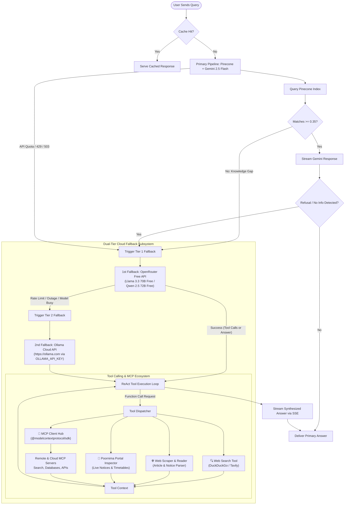
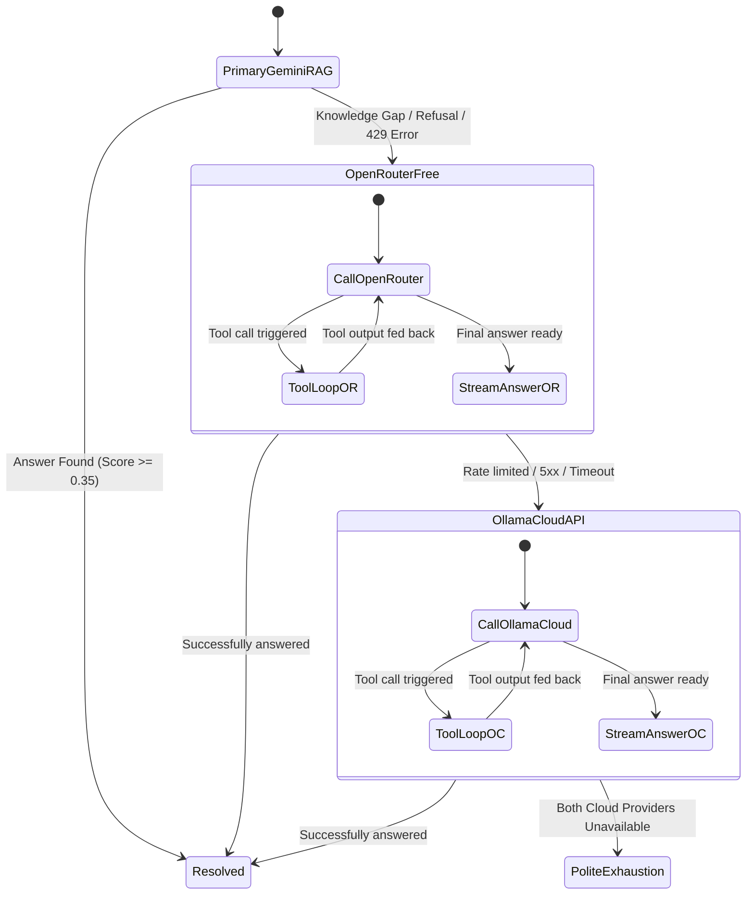
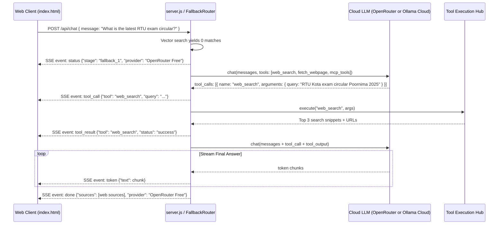

# Fallback Agent Architecture & Implementation Plan (Dual-Tier Cloud Fallback)
**Poornima Oracle AI Assistant**

---

## 1. System Architecture Overview

This plan defines a dual-tier cloud fallback architecture with agentic tool calling and Model Context Protocol (MCP) capabilities for **Poornima Oracle**.

When the primary Gemini RAG system cannot answer (due to knowledge base gaps, missing context, low vector similarity, API quota limits, or model refusal), queries escalate through a sequential 2-tier cloud fallback pipeline:
1. **Tier 1 Cloud Fallback:** **OpenRouter API** utilizing free-tier models (`:free` suffix) with native function/tool calling.
2. **Tier 2 Cloud Fallback:** **Ollama Cloud API** (`https://ollama.com` or remote hosted Ollama) authenticated via `OLLAMA_API_KEY` for hosted cloud models (completely non-local, zero offline dependency).



---

## 2. Escalation & Failover Hierarchy



| Pipeline Step | Provider & Endpoint | Target Free Models | Authentication | Failover Condition |
| :--- | :--- | :--- | :--- | :--- |
| **Primary** | Google Gemini (`gemini-2.5-flash`) | `gemini-2.5-flash` | `GEMINI_API_KEY` | Vector match `< 0.35`, refusal phrase, quota 429, or HTTP 503 |
| **1st Fallback** | **OpenRouter API** (`https://openrouter.ai/api/v1/chat/completions`) | `meta-llama/llama-3.3-70b-instruct:free`<br/>`qwen/qwen-2.5-72b-instruct:free`<br/>`google/gemini-2.0-flash-exp:free`<br/>`deepseek/deepseek-r1:free` | `OPENROUTER_API_KEY` (Free tier) | Upstream 429 rate limit, 502/503 capacity limit, or timeout (>12s) |
| **2nd Fallback** | **Ollama Cloud API** (`https://ollama.com/api/chat` or remote host) | `llama3.2`<br/>`qwen2.5:7b`<br/>`mistral`<br/>`deepseek-r1:8b` | `OLLAMA_API_KEY` via `Authorization: Bearer <key>` | Hard upstream failure |

---

## 3. Provider Configuration Specifications

### 1st Fallback: OpenRouter Free Tier
- **Endpoint:** `https://openrouter.ai/api/v1/chat/completions`
- **Model Default:** `meta-llama/llama-3.3-70b-instruct:free` (Fallbacks: `qwen/qwen-2.5-72b-instruct:free`, `google/gemini-2.0-flash-exp:free`)
- **Headers:**
  ```javascript
  {
    'Authorization': `Bearer ${process.env.OPENROUTER_API_KEY}`,
    'HTTP-Referer': 'https://poornima-oracle.onrender.com',
    'X-Title': 'Poornima Oracle Fallback Agent',
    'Content-Type': 'application/json'
  }
  ```
- **Function Calling:** Standard OpenAI JSON Schema format (`tools: [{ type: "function", function: { ... } }]`).

### 2nd Fallback: Ollama Cloud API (Remote / Non-Local)
- **Endpoint:** `https://ollama.com` (Configurable via `OLLAMA_HOST`)
- **Authentication:** Bearer token authorization header with `OLLAMA_API_KEY`.
- **Implementation via Official `ollama` SDK:**
  ```javascript
  import { Ollama } from 'ollama';

  const ollamaCloud = new Ollama({
    host: process.env.OLLAMA_HOST || 'https://ollama.com',
    headers: {
      Authorization: `Bearer ${process.env.OLLAMA_API_KEY}`
    }
  });

  const response = await ollamaCloud.chat({
    model: process.env.OLLAMA_CLOUD_MODEL || 'llama3.2',
    messages,
    tools: availableTools,
    stream: true
  });
  ```
- **No local installation or GPU required.** All processing runs through the remote cloud API.

---

## 4. Tool Calling & Agentic Execution Engine

Both fallback tiers share an identical tool execution engine and tool definition registry:



### Core Built-in Tools:
1. **`web_search`:**
   - Free Internet search using DuckDuckGo (zero API key required) or Tavily/Brave Search fallback.
   - Extracts top snippet titles, URLs, and summaries.
2. **`fetch_webpage`:**
   - Fetches and parses target HTML via `fetch` + `cheerio` into clean markdown, stripping boilerplate and ads.
3. **`poornima_portal_inspector`:**
   - Directly scrapes current circulars, examination schedules, and admission notifications from `poornima.edu.in` and university subdomains.
4. **`datetime_calculator`:**
   - Computes current dates, academic deadlines, and day intervals.

---

## 5. Model Context Protocol (MCP) Integration

Both OpenRouter and Ollama Cloud can access external tools dynamically via the official **`@modelcontextprotocol/sdk`**.

### MCP Hub Architecture:
```
[Fallback Router]
        │
        ▼
[MCP Client Manager (@modelcontextprotocol/sdk)]
        │
        ├── StdioClientTransport ──> Local server processes (when configured)
        │
        └── SSEClientTransport ────> Cloud / Remote MCP Servers (HTTP/SSE)
```

1. **Configuration (`mcp-servers.json`):** Defines accessible MCP endpoints (e.g. SQLite, GitHub, Tavily, Google Maps).
2. **Dynamic Tool Reflection:**
   - `client.listTools()` fetches tools and formats them into JSON Schema functions recognized by both OpenRouter and Ollama.
3. **Tool Execution:**
   - When the agent returns a tool call starting with `mcp__*`, the request is routed through `mcpClient.callTool({ name, arguments })` with strict 10s timeouts.

---

## 6. Frontend Streaming & UI Telemetry

To provide full visibility to students when a query is handled by a fallback agent:

### 1. Extended SSE Protocol
- `event: status` -> `{ "stage": "fallback_tier1" | "fallback_tier2", "provider": "OpenRouter (Llama 3.3 70B)" | "Ollama Cloud (Llama 3.2)", "text": "Consulting Fallback Agent & Searching Web..." }`
- `event: tool_call` -> `{ "tool": "web_search", "query": "..." }`
- `event: tool_result` -> `{ "tool": "web_search", "status": "success" }`
- `event: token` -> Streamed markdown tokens
- `event: done` -> Final payload with citations and provider tag

### 2. UI Elements in `index.html`
- **Fallback Badge:** Displays above the assistant message:
  - `⚡ Fallback Agent: OpenRouter Free (Web Search Active)` or `☁️ Fallback Agent: Ollama Cloud`
- **Collapsible Tool Tray:** Displays accordion of executed tools (e.g., `🔍 Searched DuckDuckGo`, `🌐 Inspected poornima.edu.in`).
- **Web Citation Chips:** External web links styled with globe icons (`data-lucide="globe"`) distinct from internal database pins.
- **Settings Modal:**
  - Fallback Agent: Toggle (Enabled / Disabled).
  - OpenRouter API Key input.
  - Ollama Cloud API Key & Host inputs.

---

## 7. Implementation Roadmap

| Phase | Tasks | Target Files |
| :--- | :--- | :--- |
| **Phase 1: Dual Cloud Core & Failover Router** | Implement `FallbackRouter` class with OpenRouter Free and Ollama Cloud API clients. Connect trigger conditions in `server.js` (`relevantMatches === 0`, refusal phrases, API 429/503 errors). | - `services/fallback-router.js`<br/>- `server.js`<br/>- `.env.example` |
| **Phase 2: Tool Calling Engine & Web Tools** | Implement ReAct tool loop (max 4 turns). Build `web_search` (DuckDuckGo) and `fetch_webpage` (Cheerio). | - `services/tools/web-search.js`<br/>- `services/tools/web-scraper.js`<br/>- `services/tools/portal-inspector.js` |
| **Phase 3: MCP Client Integration** | Add `@modelcontextprotocol/sdk`. Implement `McpManager` for dynamic tool discovery and execution via SSE/Stdio transports. | - `services/mcp-manager.js`<br/>- `mcp-servers.json` |
| **Phase 4: Frontend UI Telemetry & Controls** | Add SSE listener for `status`, `tool_call`, and `tool_result`. Build visual tool activity accordion, fallback badges, and Settings modal inputs. | - `index.html`<br/>- `styles.css` |

---

## 8. Safety & Guardrails

1. **Zero Unexpected Costs:**
   - OpenRouter requests strictly target models with the `:free` suffix.
   - Ollama Cloud requests use the configured free/included cloud model tier.
2. **Infinite Loop Safeguard:**
   - Maximum 4 tool iterations per user query.
   - Individual tool execution timeout capped at 8,000ms.
3. **SSRF Protection:**
   - Web scraper strictly blocks private IPv4/IPv6 ranges (`127.0.0.1`, `10.0.0.0/8`, `192.168.0.0/16`, `169.254.169.254`).
4. **Instant Cancellation:**
   - Client disconnect (`req.on('close')`) or "Stop Generating" button triggers `AbortController`, terminating active cloud LLM requests and running tool calls immediately.
