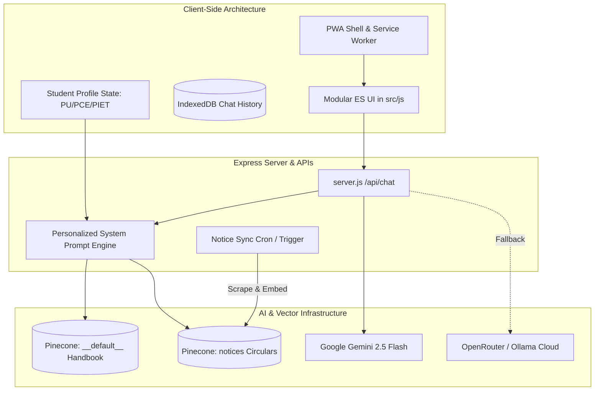

# 📋 Implementation Plan: RAG 2.0, Student Personalization & PWA

**Project:** Poornima Oracle (Campus RAG Assistant)  
**Author:** Sunny Dev (`sunnydev07`)  
**Target Platform:** Web, Mobile (PWA Standalone), Node.js/Express Backend  
**Date:** September 2026  

---

## 🎯 Objectives & Scope

This plan details the implementation of three high-value capabilities for Poornima Oracle:

1. **📱 Progressive Web App (PWA):** Zero-install, full-screen mobile app experience with offline IndexedDB history access and native app install prompts.
2. **🎓 Student Personalization & Profile Context:** Automatic answer customization tailored to the student's specific college (PU vs. PCE vs. PIET), residential status (Hosteller vs. Day Scholar), and academic branch/year.
3. **🔄 RAG 2.0 & Automated Notice Ingestion Pipeline:** Automated live synchronization of new circulars and portal notices from `poornima.edu.in` directly into Pinecone vector storage with Gemini embeddings.

---

## 🏗️ Architecture Blueprint



---

## 📱 Phase 1: Progressive Web App (PWA) & Offline Shell

### 1.1 Goals
- Enable one-tap **"Install App"** on Android Chrome, iOS Safari, and Windows/Mac desktop browsers.
- Enable full-screen standalone mobile view without browser URL bars.
- Cache static CSS/JS assets via Service Worker so users can view and read historical chats even with zero internet connectivity.

### 1.2 Technical Specifications

#### File 1: `public/manifest.json`
```json
{
  "name": "Poornima Oracle",
  "short_name": "Oracle",
  "description": "Official AI Campus Assistant for Poornima Group of Colleges",
  "start_url": "/",
  "display": "standalone",
  "background_color": "#09090b",
  "theme_color": "#09090b",
  "orientation": "portrait-primary",
  "icons": [
    {
      "src": "/src/assets/icon-192.png",
      "type": "image/png",
      "sizes": "192x192",
      "purpose": "any"
    },
    {
      "src": "/src/assets/icon-512.png",
      "type": "image/png",
      "sizes": "512x512",
      "purpose": "any maskable"
    }
  ]
}
```

#### File 2: `sw.js` (Root Service Worker)
- **Cache Strategy:**
  - **Cache-First (Stale-While-Revalidate):** Static assets (`/styles.css`, `/src/js/**/*.js`, Lucide icon script, Marked.js, DOMPurify, Google Fonts).
  - **Network-Only (Never Cache):** `/api/chat`, `/api/health`, `/api/feedback`.
  - **Offline Fallback:** Return cached app shell if network drops while navigating.

#### File 3: `src/js/pwa/installPrompt.js`
- Capture the browser's `beforeinstallprompt` event.
- Render a subtle **"Install App"** button inside the Header or Settings Modal.
- Provide clear instructions for iOS users (*"Tap Share -> Add to Home Screen"*).

### 1.3 Execution Checklist
- [x] Generate standard app icons (192x192, 512x512 maskable, SVG vector fallback).
- [x] Create `manifest.json` and register link tags in `index.html`.
- [x] Implement `sw.js` with versioned cache busting (`poornima-oracle-v1`).
- [x] Register Service Worker in `src/js/app.js` on `window.load` (`initPwa`).
- [x] Add Install App action button in `src/js/components/modal.js` and header.

---

## 🎓 Phase 2: Student Personalization & Profile Context

### 2.1 Goals
- Eliminate repetitive clarifying questions (e.g., *"Which college are you in?"*, *"Are you a hosteller?"*).
- Personalize queries like *"When is my bus leaving?"* or *"What is my mess menu?"* automatically based on stored user profile.

### 2.2 Profile Schema & Defaults

```typescript
interface StudentProfile {
  college: 'PU' | 'PCE' | 'PIET' | 'GENERAL'; // Default: GENERAL
  status: 'hosteller' | 'day_scholar' | 'bus_commuter'; // Default: day_scholar
  course: 'B.Tech' | 'BBA' | 'BCA' | 'MBA' | 'Diploma' | 'Other'; // Default: B.Tech
  year: '1st' | '2nd' | '3rd' | '4th' | 'Faculty' | 'Alumni'; // Default: 1st
  branch: string; // e.g. 'CSE', 'AI-DS', 'ECE', 'Civil'
}
```

### 2.3 Storage & UI Integration
- **Storage:** Persisted locally via `localStorage.getItem('poornima_student_profile')`.
- **Header Profile Pill:** A compact badge in the header (e.g. `🎓 PCE · 2nd Yr · Hosteller`) next to the settings button.
- **Profile Modal / Quick Edit Tab:** Add a tab inside the Settings Modal (or standalone dialog) where students can configure their profile in 3 taps.

### 2.4 Prompt & API Integration
- Pass the profile in the `/api/chat` request body:
  ```json
  {
    "message": "What is the hostel gate closing time?",
    "profile": {
      "college": "PU",
      "status": "hosteller",
      "year": "1st"
    }
  }
  ```
- In `server.js` and `services/fallback-router.js`, dynamically inject the user's profile into the system prompt:
  ```markdown
  User Profile:
  - Campus: Poornima University (PU)
  - Student Type: Hosteller (1st Year, B.Tech)
  *Tailor rules (curfew, mess timings, exams) specifically to this profile.*
  ```

### 2.5 Execution Checklist
- [ ] Create `src/js/profile/profileStore.js` with getter, setter, and default fallback.
- [ ] Add Profile Pill to `index.html` header and modal settings editor in `src/js/components/modal.js`.
- [ ] Pass `profile` parameter from `src/js/api/sseClient.js` in `/api/chat` payload.
- [ ] Update `server.js:buildSystemInstruction()` and `services/fallback-router.js:buildFallbackSystemPrompt()` to incorporate user profile constraints.

---

## 🔄 Phase 3: RAG 2.0 & Automated Ingestion Pipeline

### 3.1 Goals
- Move beyond static vector databases by syncing official circulars and notices continuously.
- Support multi-namespace retrieval in Pinecone (`__default__` for institutional regulations, `notices` for dynamic circulars).

### 3.2 Pipeline Architecture

```
[Poornima Notice Portal / Circulars]
                │
                ▼ (Cheerio Crawler: services/crawler/notice-sync.js)
        [Clean Text & Metadata]
                │  (title, date, category, url, college)
                ▼ (Text Chunker: 500 tokens, 100 overlap)
        [Document Chunks]
                │
                ▼ (Google GenAI: gemini-embedding-001)
        [768-dim Vector Embeddings]
                │
                ▼ (Pinecone Upsert: namespace='notices')
        [Pinecone Notice Namespace]
```

### 3.3 Components to Build

#### 1. Notice Crawler & Extractor (`services/crawler/notice-sync.js`)
- Crawls official Poornima notices:
  - `https://www.poornima.edu.in/notices/`
  - RTU circulars / examination boards
- Extracts: Title, Date, Category (Exam / Holiday / Fee / Placement), PDF links, and body text.
- Keeps track of processed hashes to prevent redundant embeddings.

#### 2. Vector Chunking & Embedding Generator
- Split text using recursive token chunking (max 500 characters / chunk with 100 char overlap).
- Embed with `@google/genai` using model `gemini-embedding-001` (768 dimensions).
- Upsert into Pinecone under namespace `notices` with metadata:
  ```json
  {
    "id": "notice-pu-2026-exam-schedule",
    "title": "PU End-Term Examination Schedule Dec 2026",
    "url": "https://poornima.edu.in/notices/exam-dec-2026",
    "category": "examination",
    "college": "PU",
    "publishedAt": "2026-09-08",
    "text": "..."
  }
  ```

#### 3. Dual-Namespace Hybrid Querying in `server.js`
- Query Pinecone across both namespaces concurrently:
  - Namespace 1: `__default__` (Handbooks, syllabus, fee regulations).
  - Namespace 2: `notices` (Fresh circulars and updates).
- Merge and rank results by cosine similarity score (`score >= RAG_MIN_SCORE`).
- Tag notice matches with special IDs (`portal-notice-...`) so frontend renders the yellow **Portal** citation badge automatically.

#### 4. Sync Trigger Options
- **CLI Command:** `npm run sync:notices` for manual or deployment triggers.
- **Node Cron:** Scheduled task running every 24 hours (or at 6:00 AM IST) in `server.js`.
- **Admin Endpoint:** `POST /api/sync-notices` secured with an admin API key.

### 3.4 Execution Checklist
- [ ] Create `services/crawler/notice-sync.js` with Cheerio scraper and deduplication cache.
- [ ] Implement text chunker and Gemini embedding batch upsert to Pinecone namespace `notices`.
- [ ] Update `server.js` vector query logic to search both `__default__` and `notices` namespaces in parallel.
- [ ] Add `npm run sync:notices` script to `package.json`.
- [ ] Add cron scheduler in `server.js` for automated nightly runs.

---

## 📅 Roadmap & Sprint Schedule

| Sprint | Focus Area | Deliverables | Estimated Time |
|---|---|---|---|
| **Sprint 1** | **PWA & Mobile Installability** | `manifest.json`, `sw.js`, app icons, install banner, offline chat history cache | 1 Session |
| **Sprint 2** | **Student Personalization** | Profile schema, localStorage store, header badge, modal editor, prompt injection | 1 Session |
| **Sprint 3** | **RAG 2.0 Ingestion Engine** | `notice-sync.js`, Cheerio scraper, Gemini embedding upsert, Pinecone namespace | 2 Sessions |
| **Sprint 4** | **Dual-Namespace RAG Search** | Multi-namespace retrieval in `server.js`, score merging, portal badge citation | 1 Session |

---

## 🛡️ Risk Management & Mitigation

| Risk | Likelihood | Impact | Mitigation Strategy |
|---|---|---|---|
| **PWA Service Worker caching stale API responses** | Low | High | Strictly exclude `/api/*` from Service Worker caches; use network-only policy for chat. |
| **Notice portal structure changes** | Medium | Medium | Wrap crawler in robust try/catch blocks; fall back to DuckDuckGo live web search tool if crawler fails. |
| **Pinecone namespace quota limits** | Low | Low | Standard Pinecone index supports unlimited namespaces at zero extra storage cost. |
| **Student profile privacy concerns** | Low | Low | Store profile exclusively on the student's device (`localStorage`); no login or tracking database required. |

---

*Plan compiled for Poornima Oracle repository (`sunnydev07/Poornima-Oracle`).*
